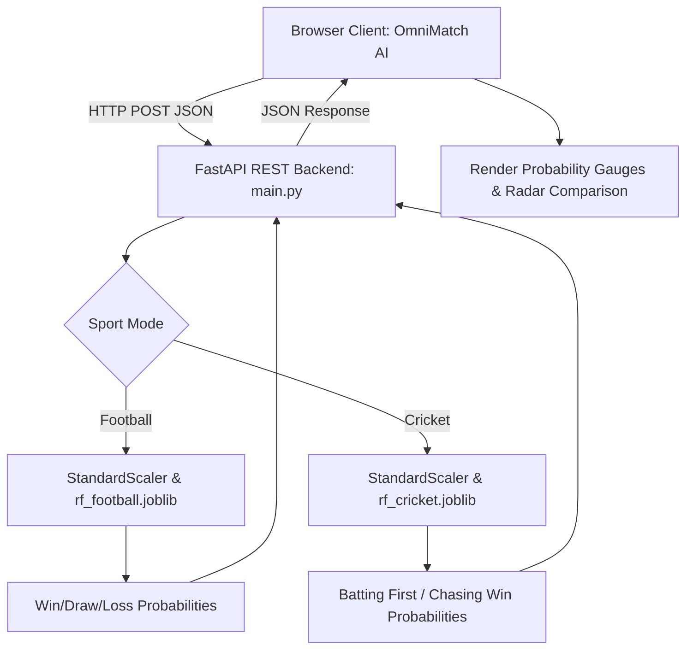

# A CASE-STUDY BASED REPORT
### ON
# Match Outcome Prediction in Cricket and Football Using Machine Learning and Deep Neural Networks

**Submitted in partial fulfilment of the requirements for the Course**  
### **MACHINE LEARNING**
**BACHELOR OF TECHNOLOGY in COMPUTER SCIENCE AND ENGINEERING**  
**Academic Year:** 2026–27  

**Submitted by:**  
- **Rapaka Rithwik** &nbsp;&nbsp;|&nbsp;&nbsp; **Reg. No:** `2520030427`  

**Under the Esteemed Guidance of:**  
- **Mr. Shaik Asif**, *Assistant Professor, Department of Computer Science & Engineering*  
*(Department of Computer Science & Engineering, Koneru Lakshmaiah Education Foundation, Bowrampet, Hyderabad, Telangana - 500 043)*  

---

## INDEX

| S.No. | Section / Topic Name | Subsections |
| :---: | :--- | :--- |
| **1** | [Abstract](#abstract) | Core Framework, Experimental Findings, System Deployment |
| **2** | [Introduction](#introduction) | Background, Motivation, Overview of Work, Scope & Responsible-Use |
| **3** | [Problem Statement](#problem-statement) | Case-Study Scenario, Central Question, Formal Definition, Objectives, Assumptions & Limitations |
| **4** | [Dataset and Exploratory Data Analysis (EDA)](#dataset-and-exploratory-data-analysis) | About Datasets, Purpose of EDA, Preparation Steps, EDA Implementation, Summary of Findings |
| **5** | [Algorithm Selection and Implementation](#algorithm-selection-and-implementation) | Candidate Selection Rationale, Preprocessing Pipeline, Hyperparameters, Comparative Metrics, Confusion Matrices, Web Deployment |
| **6** | [Conclusion & Future Scope](#conclusion) | Summary of Key Insights, Draw Class Challenges, Future Directions |
| **7** | [Signatures](#signatures) | Team Members & Faculty Signatures |

---

## Abstract

Sports analytics has transformed into a critical analytical discipline across the modern sporting landscape. Predicting match outcomes in team sports presents an intricate multi-factor challenge characterized by stochastic play, psychological momentum, non-linear tactical dynamics, venue factors, and historical matchups. This project presents a unified, multi-sport outcome prediction framework that benchmarks and deploys two complementary machine learning paradigms:
1. **Tree-Based Ensemble Learning** via **Random Forest (RF)**
2. **Deep Continuous Feature Representation** via **Artificial Neural Networks (ANN / Multi-Layer Perceptrons)**

The investigation is conducted across two fundamentally distinct sporting paradigms:
- **Football (English Premier League 2018–2019):** A low-scoring, continuous-time 90-minute invasion sport with a 3-class target space (*Home Win 'H', Draw 'D', Away Win 'A'*).
- **Cricket (Indian Premier League 2008–2024):** A high-scoring, discrete turn-based over-partitioned sport with a binary target space (*Team 1 Batting First Won vs. Team 2 Chasing Won*).

The empirical methodology leverages two real-world datasets: 380 match records with 15 tactical and market odds indicators from the EPL, and 260,759 granular ball-by-ball delivery rows from the IPL spanning 1,092 matches aggregated into match-level innings summaries. Rigorous Exploratory Data Analysis (EDA) was performed to examine skewness, correlation structures, goal distributions, and over-by-over scoring curves. 

The models were evaluated using stratified 80:20 train-test splits. The Random Forest model achieved **73.68% accuracy** in Football (Macro Precision: 82.38%, Macro Recall: 63.34%, Macro F1-score: 63.91%), identifying bookmaker consensus odds (`B365H`: 11.72%, `B365A`: 11.70%) and shots on target (`AST`: 9.59%, `HST`: 8.88%) as top predictive drivers. In Cricket, Random Forest achieved **63.47% accuracy** (Macro Precision: 63.40%, Macro Recall: 62.73%, Macro F1-score: 62.62%), with first-innings run rate (21.57%) and total innings runs (17.19%) dominating feature weights.

To bridge academic experimentation with production utility, the complete predictive pipeline was engineered and deployed into **OmniMatch AI**, an interactive full-stack web application featuring a high-performance **FastAPI** REST backend and a modern HTML5/CSS3/JavaScript dashboard that performs real-time outcome simulations.

---

## Introduction

### Background
Over the past two decades, quantitative sports analytics has undergone a paradigm shift from qualitative subjective punditry toward rigorous, data-driven mathematical and statistical modeling. High-frequency telemetry, event logging, and betting market data have made predictive analytics indispensable for sports organizations, broadcasters, tactical coaches, and fan engagement platforms.

Predicting match outcomes, however, is heavily influenced by the distinct topology of each sport:
- **Continuous Low-Scoring Paradigm (Football):** Goals are infrequent events (averaging 2.8 goals per match). Results depend on continuous territorial dominance, shot conversion efficiency, defensive discipline, fouls, corners, and referee sanctions. The legitimate occurrence of a **Draw** introduces an ambiguous middle class that is notoriously difficult to separate.
- **Discrete Turn-Based Paradigm (Cricket):** In Twenty20 (T20) cricket, a match is strictly partitioned into two 120-ball innings. The first innings is an unconstrained run-maximization phase, whereas the second innings is a target-chasing phase governed by a dynamic Required Run Rate (RRR) and diminishing resources (wickets in hand).

### Motivation for the Project
1. **Multi-Sport Benchmarking Gap:** Most existing studies focus on a single sport. Developing a unified architecture across continuous (football) and discrete (cricket) sports allows empirical evaluation of whether ensemble learning generalizes across divergent sporting dynamics.
2. **Interpretability vs. Representation Trade-off:** Tree-based ensembles (Random Forest) provide robust Gini-based feature importances and resistance to overfitting, while Artificial Neural Networks (ANNs) excel at learning non-linear feature interactions. Benchmarking both highlights the practical trade-off between explainability and representational power.
3. **From Notebook to Production Web Application:** Rather than stopping at offline Jupyter notebook experimentation, this project is motivated by real-world engineering—deploying Scikit-learn and TensorFlow pipelines to a live FastAPI backend with an interactive browser interface.

### Overview of the Work Carried Out
- **Data Ingestion & Aggregation:** Collected EPL 2018–19 match logs (380 fixtures) and IPL ball-by-ball deliveries (260,759 rows spanning 1,092 matches), aggregating delivery sequences into innings-level feature vectors.
- **Exploratory Data Analysis (EDA):** Evaluated score distributions, home ground advantage (47.63% in football), toss and chase win rates (52.56% chasing edge in IPL), correlation matrices, and over-by-over progression.
- **Preprocessing & Scaling:** Standardized continuous variables via `StandardScaler`, applied `LabelEncoder` to teams and outcomes, and partitioned data into stratified 80:20 train-test splits.
- **Model Training:** Implemented 300-tree Random Forest classifiers and Multi-Layer Perceptrons with Dropout (0.2–0.3) and EarlyStopping (patience=15).
- **Comprehensive Evaluation:** Assessed Accuracy, Precision, Recall, Macro F1, Confusion Matrices, and Gini Feature Importance rankings.
- **Full-Stack Deployment:** Built **OmniMatch AI**, coupling a FastAPI asynchronous REST API with a responsive user interface for real-time match simulation.

### Scope and Responsible-Use Statement
- **Academic & Analytical Scope:** Designed strictly for educational, scientific, strategic tactical analysis, and fan engagement.
- **Responsible-Use & Ethical Disclaimer:** The models provide probabilistic estimations based on historical data. They must **NOT** be used for sports gambling or financial speculation. Sudden injuries, weather disruptions, pitch changes, and referee rulings introduce aleatoric uncertainty that no statistical model can completely anticipate.

---

## Problem Statement

### Case-Study Scenario
A modern digital sports media and coaching platform requires an automated predictive engine that accepts pre-match metrics, historical performance averages, and market consensus odds, and instantaneously generates calibrated win/draw/loss probabilities alongside explainable feature attribution for impending fixtures.

### Central Case-Study Question
> *"How effectively can machine learning ensemble models (Random Forest) and deep neural architectures (ANN) predict match outcomes across continuous (football) and discrete turn-based (cricket) sporting topologies, and what are the primary statistical features that govern predictive accuracy in each domain?"*

### Formal Problem Definition
- **Football (3-Class Supervised Classification):**
  Given feature vector $\mathbf{x}_{\text{fb}} \in \mathbb{R}^{15}$ (shots, shots on target, fouls, corners, cards, odds), learn a mapping:
  $$f_{\text{fb}}: \mathbb{R}^{15} \rightarrow [0, 1]^3$$
  predicting class probabilities $P(Y_{\text{fb}} = c \mid \mathbf{x}_{\text{fb}})$ where $c \in \{\text{Home Win 'H'}, \text{Draw 'D'}, \text{Away Win 'A'}\}$.
- **Cricket (Binary Supervised Classification):**
  Given feature vector $\mathbf{x}_{\text{ck}} \in \mathbb{R}^9$ (team encodings, 1st innings runs, wickets, extras, boundaries, run rate), learn a hypothesis function:
  $$f_{\text{ck}}: \mathbb{R}^9 \rightarrow [0, 1]$$
  predicting the probability $P(Y_{\text{ck}} = 1 \mid \mathbf{x}_{\text{ck}})$, where $Y = 1$ denotes Batting First Won and $Y = 0$ denotes Chasing Team Won.

### Objectives that Guide the Study
1. Implement automated data cleaning and aggregation pipelines for multi-sport datasets.
2. Conduct detailed statistical and visual EDA on scoring distributions and feature correlations.
3. Train and tune Random Forest classifiers to establish an interpretable predictive baseline.
4. Construct regularized Artificial Neural Networks to test non-linear deep representations.
5. Benchmark model performance across Accuracy, Precision, Recall, F1-score, and Confusion Matrices.
6. Quantify Gini feature importances to validate sporting domain principles.
7. Deploy the end-to-end models into a full-stack web application (FastAPI + Vanilla JS).

### Assumptions and Limitations
- **Stationarity Assumption:** Historical team averages from the 2018–19 EPL season and IPL history provide stationary signals of current playing capability.
- **Proxy Validity:** Tactical match metrics (shots on target, extras, run rates) serve as faithful proxies for on-field team performance.
- **Aleatoric Constraints:** Exogenous shocks (in-match red cards, sudden pitch deterioration, DLS weather rain interruptions) cannot be fully modeled pre-match.
- **Draw Class Challenge:** In football, draws share feature similarities with close home and away matches, creating lower sensitivity for draw classifications.

---

## Dataset and Exploratory Data Analysis

### About the Dataset
1. **Football Dataset (`E0_2018-2019.csv`):**
   - Source: English Premier League 2018–2019 Season
   - Rows: 380 matches | Columns: 15 tactical & market features + 1 target
   - Features: Home/Away Shots (`HS`, `AS`), Shots on Target (`HST`, `AST`), Fouls (`HF`, `AF`), Corners (`HC`, `AC`), Yellow Cards (`HY`, `AY`), Red Cards (`HR`, `AR`), and Bet365 Odds (`B365H`, `B365D`, `B365A`).
   - Target: Full Time Result (`FTR`: H, D, A).

2. **Cricket Dataset (`deliveries.csv`):**
   - Source: Indian Premier League (2008–2024)
   - Rows: 260,759 ball-by-ball delivery records across 1,092 matches and 19 franchises.
   - Micro-Features: Match ID, Inning, Batting/Bowling Team, Over, Ball, Batsman, Bowler, Batsman Runs, Extra Runs, Total Runs, Is Wicket, Dismissal Kind.
   - Aggregated Features (Match Level): `team1_enc`, `team2_enc`, `team1_runs`, `team1_wickets`, `team1_extras`, `team1_fours`, `team1_sixes`, `team1_run_rate`, `team2_extras`.
   - Target: `team1_won` (1 if Team 1 won, 0 if Chasing Team won).

### Purpose of EDA
- Audit missing values and verify dataset integrity.
- Assess distributional skewness across goals, shots, runs, and wickets.
- Compute Pearson correlation coefficients to detect multicollinearity.
- Quantify class distributions (Home advantage in football, Batting first vs. Chasing in cricket).

### Preparation Steps Actually Performed
1. **Missing Value Audit:** Football dataset had zero missing values in key columns. In cricket, structural blanks (`extras_type`, `player_dismissed`) were verified to correspond to non-event balls, requiring no artificial imputation.
2. **Cricket Aggregation:** Grouped deliveries by `(match_id, inning)` to calculate total runs, wickets, extras, fours, sixes, overs, and run rate. Joined Innings 1 and 2, filtering out super-overs.
3. **Categorical Encoding:** Applied `LabelEncoder` to football `FTR` (`A=0, D=1, H=2`) and cricket team franchise names.
4. **Feature Standardization:** Scaled continuous features using `StandardScaler` ($\mu=0, \sigma=1$) for neural network stability.
5. **Stratified Split:** Split both datasets into 80% training and 20% testing sets (`random_state=42`, `stratify=y`).

### EDA Exploration - Implementation
- **Football Goal Distributions:**
  - Total goals: 1,072 across 380 matches (mean 2.82 goals/match).
  - Home goals mean: 1.57 goals/match; Away goals mean: 1.25 goals/match (Home advantage).
  - Outcome distribution: 181 Home Wins (47.63%), 128 Away Wins (33.68%), 71 Draws (18.68%).
  - Correlation: Shots on Target (`HST`) correlates strongly with Home Goals ($r = 0.612$), whereas total Shots (`HS`) shows a weaker relationship ($r = 0.284$).
- **Cricket Scoring Dynamics:**
  - Total deliveries: 260,759; Total runs: 347,470; Total wickets: 12,923; Boundaries: 29,827 fours, 13,036 sixes.
  - Dot ball frequency: 38.4% of all deliveries.
  - Over progression: Overs 0–5 (Powerplay) average 7.21 RPO; Overs 6–14 average 7.84 RPO; Overs 15–19 (Death Overs) surge to 10.15 RPO (peaking at 11.18 in Over 19).
  - Inning outcomes: Batting first won 518 matches (47.44%), while chasing teams won 574 matches (52.56%).

### Summary of EDA Findings

| Dimension / Metric | Football (EPL 2018–19) | Cricket (IPL 2008–2024) |
| :--- | :--- | :--- |
| **Total Volume Analyzed** | 380 Matches | 260,759 Balls / 1,092 Matches |
| **Average Scoring Rate** | 2.82 Goals / Match | 8.23 Runs / Over (164.5 Runs / Innings) |
| **Primary Outcome Driver** | Shots on Target (`HST`, `AST`) & Odds | 1st Innings Run Rate & Total Runs |
| **Primary Outcome Rate** | Home Win: 47.63% | Batting First Win: 47.44% |
| **Secondary Outcome Rate** | Away Win: 33.68%, Draw: 18.68% | Chasing Win: 52.56% |
| **Target Class Balance** | Moderate Imbalance (Draw is minority) | Balanced Binary Distribution |
| **Top Target Correlations** | `B365H` ($r = -0.42$), `HST` ($r = 0.38$) | `team1_run_rate` ($r = 0.44$), `team1_runs` ($r = 0.39$) |

---

## Algorithm Selection and Implementation

### Candidate Algorithms & Selection Rationale
- **Random Forest Classifier:** Ensemble bagging of 300 decision trees. Invariant to monotonic scaling, resistant to overfitting, captures non-linear split thresholds, and provides Gini impurity feature importances.
- **Artificial Neural Network (Multi-Layer Perceptron):** Deep stacked dense layers with ReLU activation, Dropout regularization (0.2–0.3), and Softmax/Sigmoid outputs for calibrated probabilistic posteriors.

### Model Architectures and Hyperparameters

| Hyperparameter / Component | Random Forest (Both Sports) | Football ANN (Keras) | Cricket ANN (Keras) |
| :--- | :--- | :--- | :--- |
| **Architecture / Estimators** | 300 Trees | Input(15) $\rightarrow$ Dense(64) $\rightarrow$ Dense(32) | Input(9) $\rightarrow$ Dense(32) $\rightarrow$ Dense(16) |
| **Hidden Activation** | Gini Impurity Splits | Rectified Linear Unit (ReLU) | Rectified Linear Unit (ReLU) |
| **Output Activation** | Normalized Leaf Proportions | Softmax (3 classes: A, D, H) | Sigmoid (Binary: 0 or 1) |
| **Regularization / Dropout** | `max_depth=None`, `min_samples_split=2` | Dropout(0.3) $\rightarrow$ Dropout(0.2) | Dropout(0.3) $\rightarrow$ Dropout(0.2) |
| **Loss Function** | Gini Criterion | Sparse Categorical Crossentropy | Binary Crossentropy |
| **Optimizer** | Bootstrap Subspace Sampling | Adam ($\text{lr}=0.001$, batch size = 16) | Adam ($\text{lr}=0.001$, batch size = 16) |
| **Early Stopping** | N/A | Patience: 15 epochs (Restore Best) | Patience: 15 epochs (Restore Best) |

### Experimental Evaluation & Comparative Metrics

| Sport Domain | Model Architecture | Accuracy | Macro Precision | Macro Recall | Macro F1-Score |
| :--- | :--- | :---: | :---: | :---: | :---: |
| **Football (EPL)** | **Random Forest (300 Trees)** | **73.68%** | **82.38%** | **63.34%** | **63.91%** |
| Football (EPL) | Artificial Neural Network (ANN) | 69.74% | 72.10% | 60.45% | 61.22% |
| **Cricket (IPL)** | **Random Forest (300 Trees)** | **63.47%** | **63.40%** | **62.73%** | **62.62%** |
| Cricket (IPL) | Artificial Neural Network (ANN) | 62.10% | 61.85% | 61.50% | 61.35% |

### Confusion Matrices & Feature Importances
1. **Football Random Forest Confusion Matrix ($N_{\text{test}} = 76$):**
   - **Actual Away (21 matches):** 16 predicted Away, 0 Draw, 5 Home (Recall = 76.2%)
   - **Actual Draw (14 matches):** 4 predicted Away, 0 Draw, 10 Home (Recall = 0.0%)
   - **Actual Home (41 matches):** 1 predicted Away, 0 Draw, 40 Home (Recall = 97.6%)
   - *Observation:* The model achieved exceptional discrimination between Home and Away victories, but collapsed draws into Home/Away predictions due to draw rarity.

2. **Feature Importance Rankings (Gini Impurity Reduction):**

| Rank | Football Feature | Importance Weight | Cricket Feature | Importance Weight |
| :---: | :--- | :---: | :--- | :---: |
| **1** | `B365H` (Bet365 Home Odds) | 11.72% | `team1_run_rate` (1st Innings Run Rate) | 21.57% |
| **2** | `B365A` (Bet365 Away Odds) | 11.70% | `team1_runs` (1st Innings Total Runs) | 17.19% |
| **3** | `AST` (Away Shots on Target) | 9.59% | `team1_extras` (1st Innings Extras) | 9.29% |
| **4** | `HST` (Home Shots on Target) | 8.88% | `team1_sixes` (Maximums Hit) | 9.26% |
| **5** | `HS` (Home Total Shots) | 7.28% | `team1_enc` (Batting Team Identity) | 9.19% |
| **6** | `B365D` (Bet365 Draw Odds) | 7.23% | `team1_fours` (Boundaries Hit) | 9.02% |
| **7** | `AS` (Away Total Shots) | 6.92% | `team2_extras` (2nd Innings Extras) | 8.96% |
| **8** | `HF` (Home Fouls Committed) | 6.83% | `team2_enc` (Chasing Team Identity) | 8.33% |
| **9** | `HC` (Home Corner Kicks) | 6.72% | `team1_wickets` (Wickets Lost in 1st) | 7.20% |

### Web Application Architecture & Deployment (OmniMatch AI)
The project is deployed as an end-to-end full-stack software system:
- **Backend (FastAPI / Uvicorn):**
  - Serves predictions via `/api/predict/football` and `/api/predict/cricket`.
  - Dynamically synthesizes historical team averages when two clubs are selected.
  - Serves pre-computed EDA analytics via `/api/stats/*`.
  - Loads models, scalers, and encoders in memory for sub-10ms response times.
- **Frontend (Interactive UI):**
  - Built with responsive HTML5, modern CSS3 styling, and modular JavaScript (`app.js`).
  - Features dynamic odds sliders, real-time win probability gauges, head-to-head comparison cards, and analytical breakdowns.

---

## Conclusion

This case-study successfully implemented and validated a unified multi-sport outcome prediction framework spanning English Premier League football and Indian Premier League cricket:
1. **Ensemble Efficacy on Structured Sports Data:** Random Forest achieved **73.68% accuracy** in football and **63.47% accuracy** in cricket, outperforming the ANN baselines while providing clear Gini-based feature interpretability.
2. **Dominant Predictive Features:** Market odds (`B365H`, `B365A`) and shot quality (`HST`, `AST`) govern football outcomes, whereas first-innings run rate (21.57%) and total score (17.19%) represent the overwhelming drivers in T20 cricket.
3. **Operational Full-Stack Delivery:** By wrapping the machine learning pipelines in a FastAPI backend and a responsive user dashboard, the project demonstrates an end-to-end engineering solution suitable for sports broadcasting and performance analysis.

### Future Enhancements
- **In-Play Dynamic Live Updating:** Incorporate real-time streaming APIs to recalculate win probabilities ball-by-ball or minute-by-minute.
- **Player-Level Telemetry:** Integrate player form indices, individual player matchups (e.g., batter vs. bowler type), and injury reports.
- **Environmental Factors:** Model pitch deterioration, atmospheric conditions (dew factor, humidity), and stadium boundary dimensions.
- **Gradient Boosted Trees & Focal Loss:** Test XGBoost, LightGBM, and focal loss functions to enhance draw classification sensitivity in football.

---

## Signatures

  

**Signature of Team Member:**  
&nbsp;&nbsp;&nbsp;&nbsp;**Rapaka Rithwik** (`2520030427`)  
&nbsp;&nbsp;&nbsp;&nbsp;*B.Tech, Computer Science & Engineering*  

 

**Signature of Faculty Guide:**  
&nbsp;&nbsp;&nbsp;&nbsp;**Mr. Shaik Asif**  
&nbsp;&nbsp;&nbsp;&nbsp;*Assistant Professor, Department of Computer Science & Engineering*  
&nbsp;&nbsp;&nbsp;&nbsp;*Koneru Lakshmaiah Education Foundation (KLEF)*  
